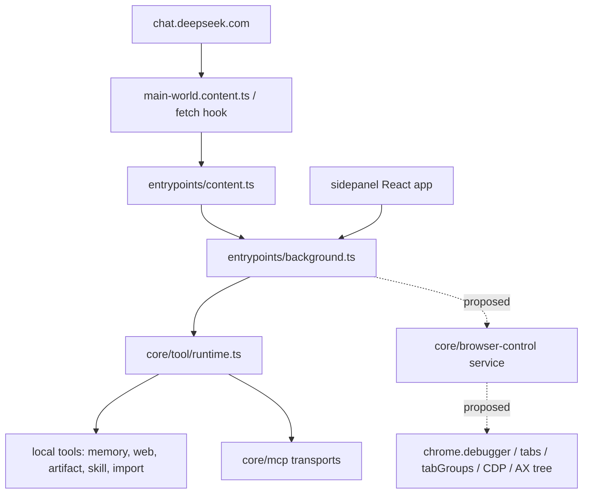

# Project Overview

## Preliminary Direction

Implement Gemini-Nexus parity browser control in DeepSeek++: a Chromium-owned CDP runtime with `chrome.debugger`, Accessibility Tree UID snapshots, controlled tab and tab group scope, browser action tools, sidepanel controls, permission governance, and verification. This is intentionally the full parity path, not a small MVP.

## Current Architecture

DeepSeek++ is a WXT / Manifest V3 extension with four primary runtime surfaces:

The current codebase has a mature tool-call and continuation loop, but it has no browser-control runtime. There is no `chrome.debugger` usage, no controlled tab registry, no CDP connection layer, no Accessibility Tree UID mapping, and no browser action descriptors.

The correct ownership boundary is background-owned browser control. `entrypoints/background.ts` is already the owner of runtime messages, permission requests, tool execution, sidepanel chat loops, automation, alarms, and offscreen sandbox. Browser control should be extracted into `core/browser-control/*` and called from background rather than implemented inside `entrypoints/content.ts` or the DeepSeek fetch hook.

## Technology Stack

| Layer | Current | Target |
|:--|:--|:--|
| Language | TypeScript | TypeScript |
| Extension Framework | WXT MV3 | WXT MV3, Chromium browser-control capability gated |
| UI | React 19 + Tailwind | React sidepanel Browser Control surface |
| Tool Protocol | DeepSeek++ direct XML tool tags via `ToolDescriptor` | Same protocol, with browser-control descriptors |
| Browser Automation | None | `chrome.debugger` + CDP + `chrome.tabs` + `chrome.tabGroups` |
| Page Observation | Existing DeepSeek page text/context only | CDP Accessibility Tree snapshot with stable UID mapping |
| Storage | `chrome.storage.local`, Dexie-backed feature stores | Existing storage plus browser-control settings/state/history |
| Package Manager | npm workspaces | unchanged |

## Entry Points

| Entry | Current Responsibility | Browser-Control Relevance |
|:--|:--|:--|
| `wxt.config.ts` | Manifest construction, permissions, CSP, browser targets, asset plugins | Add Chromium-only `debugger`, `tabs`, `tabGroups`; keep unsupported paths explicit |
| `entrypoints/background.ts` | Background RPC, tool runtime execution, sidepanel chat loop, automation, permissions, broadcasts | Own CDP service lifecycle, controlled tabs, tab groups, browser-control messages |
| `entrypoints/content.ts` | DeepSeek page coordination, tool cards, inline agent UI, content-side artifact fast path | Should not own CDP state; may only render status/tool cards and request background execution |
| `entrypoints/main-world.content.ts` | MAIN world fetch hook bridge | No direct browser-control implementation; receives descriptors through existing hook state |
| `core/tool/runtime.ts` | Tool descriptor aggregation and execution dispatch | Add browser-control local provider and execution path |
| `core/tool-loop/engine.ts` | Sequential tool execution and continuation helper | Reuse for browser actions; add result-size and observation contracts upstream |
| `core/inline-agent/loop.ts` | Manual-chat inline agent continuation | Must allow browser-control tools and preserve snapshot observation discipline |
| `entrypoints/sidepanel/*` | React UI for chat, tools, MCP, settings, automation, projects | Add Browser Control management page under Capabilities |

## Build & Run

Important commands from `package.json`:

| Command | Purpose |
|:--|:--|
| `npm run dev` | WXT development server |
| `npm run build:chrome` | Chrome MV3 build |
| `npm run build:edge` | Edge MV3 build |
| `npm run build:firefox` | Firefox MV3 build |
| `npm run build:all` | Chrome + Edge + Firefox builds |
| `npm run compile` | TypeScript check |
| `npm test` | Vitest suite |
| `npm run verify:manifest-policy` | Manifest permission and packaging policy check |
| `npm run prompt:freeze` | Prompt contract freeze |
| `npm run ci:quality` | Current strongest full quality gate |

Browser-control work must update `scripts/manifest-policy-check.mjs` whenever manifest permissions or public permission documentation change.

## Testing Baseline

Existing tests cover:

- tool parser, streaming tool parser, tool card rendering, tool restore storage
- MCP discovery/transport smoke and mock verification
- platform capabilities
- inline agent prompts and renderer behavior
- sidepanel navigation and product surfaces
- manifest policy and release asset checks through npm scripts

Missing for browser-control parity:

- mock `chrome.debugger` attach/detach/sendCommand tests
- `chrome.tabs` and `chrome.tabGroups` lifecycle tests
- Accessibility Tree formatting and UID stability tests
- action tests for click, hover, fill, form fill, key press, file attach, dialog handling, wait, evaluate
- result budget tests for large snapshots
- unsupported Firefox and Android behavior tests
- real Chrome smoke against a fixture page

## Project Governance Baseline

| Surface | Status |
|:--|:--|
| Shared instructions | `AGENTS.md`, auto-generated from Claude project memory; do not hand-edit durable rules unless the sync source is also updated |
| Claude-specific instructions | no root `CLAUDE.md`; `.claude/settings.local.json` may exist |
| Other platform rule surfaces | `.codex/` exists, no project skill files found |
| Native memory | Codex native memory is available and preferred for durable facts |
| Repo fallback memory | none declared; do not create one without explicit user selection |
| Active old spec files | `docs/analysis`, `docs/plan`, and `docs/progress` held a completed Better DeepSeek spec; archived copy exists under `docs/archives/better-deepseek-capability-adoption/` |

## External Integrations

- DeepSeek Web, via request/response hook on `chat.deepseek.com`.
- DeepSeek official API / sidepanel chat loop.
- MCP tools through HTTP, SSE, streamable HTTP, stdio bridge, and native messaging.
- Chrome extension APIs: existing `storage`, `alarms`, `nativeMessaging`, `contextMenus`, `offscreen`, `sidePanel`; browser-control parity adds Chromium-specific `debugger`, `tabs`, and `tabGroups`.
- Android WebView bridge, currently non-extension and explicitly lacks native browser extension APIs.

## Phase 1 Finding

Browser control should be introduced as a new platform capability plus local tool provider, not as an extension of MCP or a content-script patch. The key invariants are:

- one background-owned debugger session manager
- one controlled tab and tab group registry
- one Accessibility Tree UID snapshot contract
- one runtime provider shared by manual chat, sidepanel chat, inline agent, and automation
- explicit unsupported behavior for Firefox and Android
