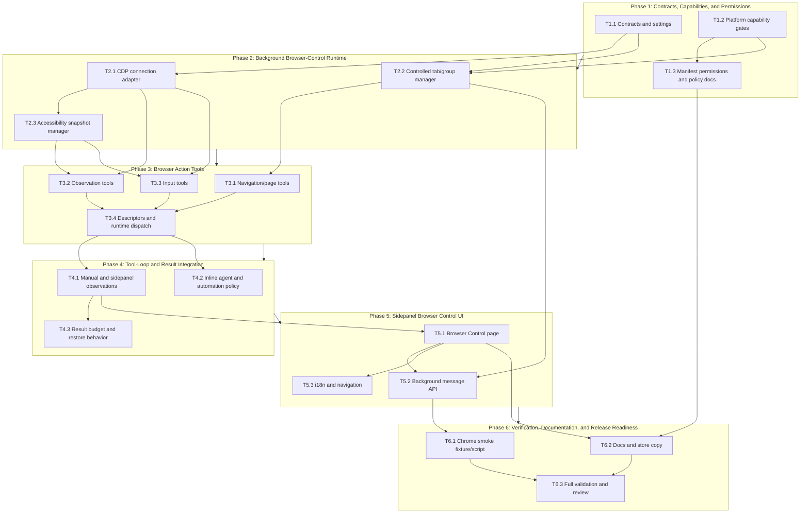

# Task Dependency Graph

```mermaid
graph TD
    subgraph P1["Phase 1: Contracts, Capabilities, and Permissions"]
        T1_1["T1.1 Contracts and settings"]
        T1_2["T1.2 Platform capability gates"]
        T1_3["T1.3 Manifest permissions and policy docs"]
        T1_2 --> T1_3
    end

    subgraph P2["Phase 2: Background Browser-Control Runtime"]
        T2_1["T2.1 CDP connection adapter"]
        T2_2["T2.2 Controlled tab/group manager"]
        T2_3["T2.3 Accessibility snapshot manager"]
        T1_1 --> T2_1
        T1_1 --> T2_2
        T1_2 --> T2_2
        T2_1 --> T2_3
    end

    subgraph P3["Phase 3: Browser Action Tools"]
        T3_1["T3.1 Navigation/page tools"]
        T3_2["T3.2 Observation tools"]
        T3_3["T3.3 Input tools"]
        T3_4["T3.4 Descriptors and runtime dispatch"]
        T2_2 --> T3_1
        T2_1 --> T3_2
        T2_3 --> T3_2
        T2_1 --> T3_3
        T2_3 --> T3_3
        T3_1 --> T3_4
        T3_2 --> T3_4
        T3_3 --> T3_4
    end

    subgraph P4["Phase 4: Tool-Loop and Result Integration"]
        T4_1["T4.1 Manual and sidepanel observations"]
        T4_2["T4.2 Inline agent and automation policy"]
        T4_3["T4.3 Result budget and restore behavior"]
        T3_4 --> T4_1
        T3_4 --> T4_2
        T4_1 --> T4_3
    end

    subgraph P5["Phase 5: Sidepanel Browser Control UI"]
        T5_1["T5.1 Browser Control page"]
        T5_2["T5.2 Background message API"]
        T5_3["T5.3 i18n and navigation"]
        T4_1 --> T5_1
        T2_2 --> T5_2
        T5_1 --> T5_2
        T5_1 --> T5_3
    end

    subgraph P6["Phase 6: Verification, Documentation, and Release Readiness"]
        T6_1["T6.1 Chrome smoke fixture/script"]
        T6_2["T6.2 Docs and store copy"]
        T6_3["T6.3 Full validation and review"]
        T5_2 --> T6_1
        T1_3 --> T6_2
        T5_1 --> T6_2
        T6_1 --> T6_3
        T6_2 --> T6_3
    end

    P1 --> P2
    P2 --> P3
    P3 --> P4
    P4 --> P5
    P5 --> P6
```
